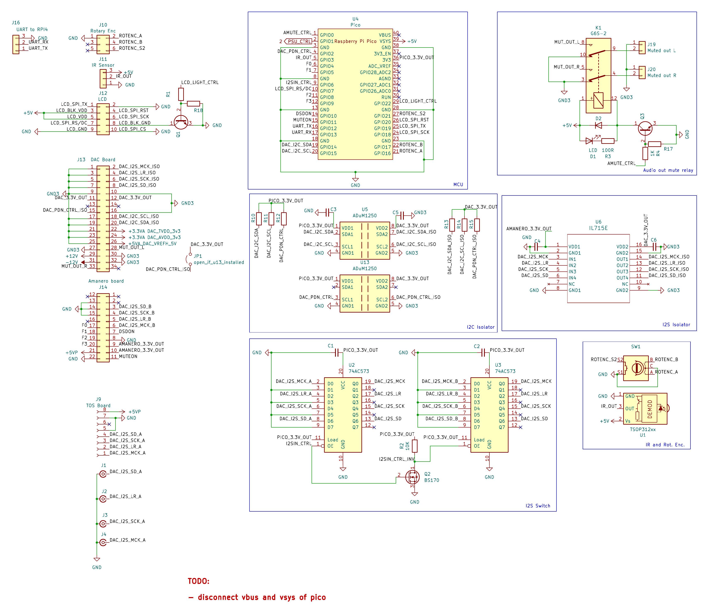
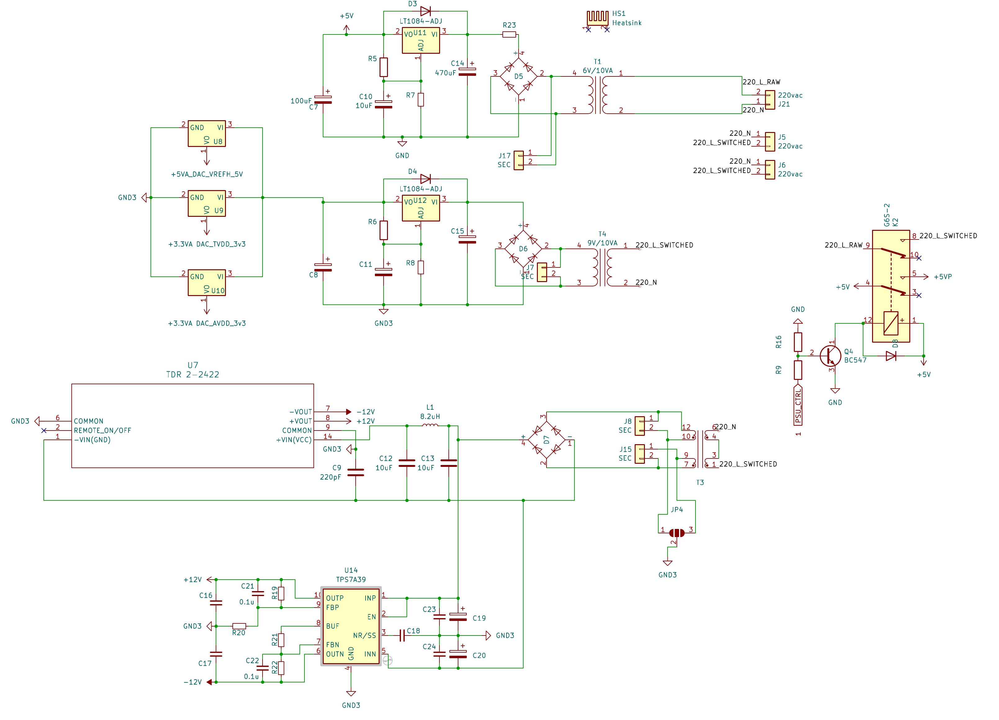
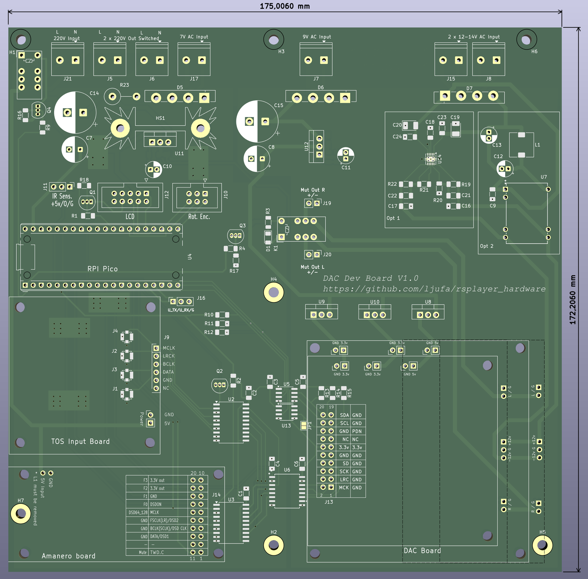
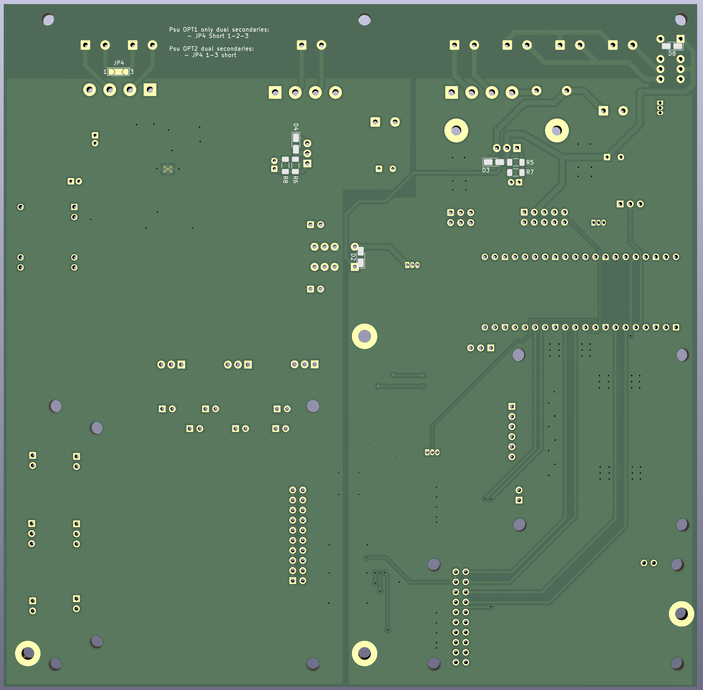
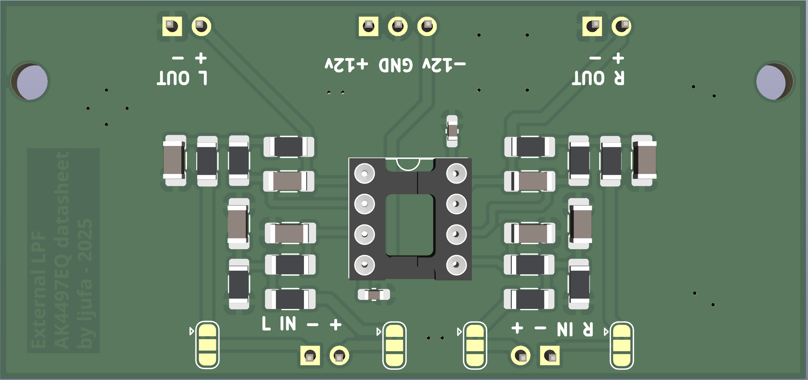
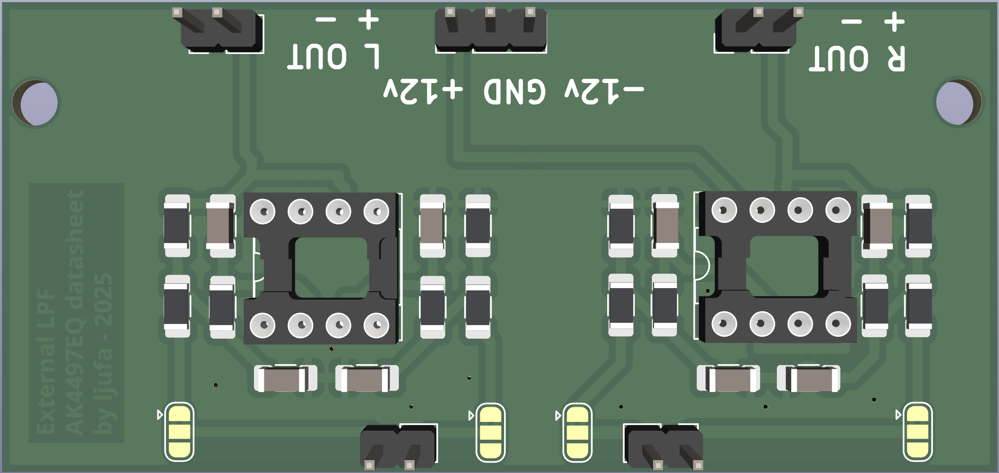
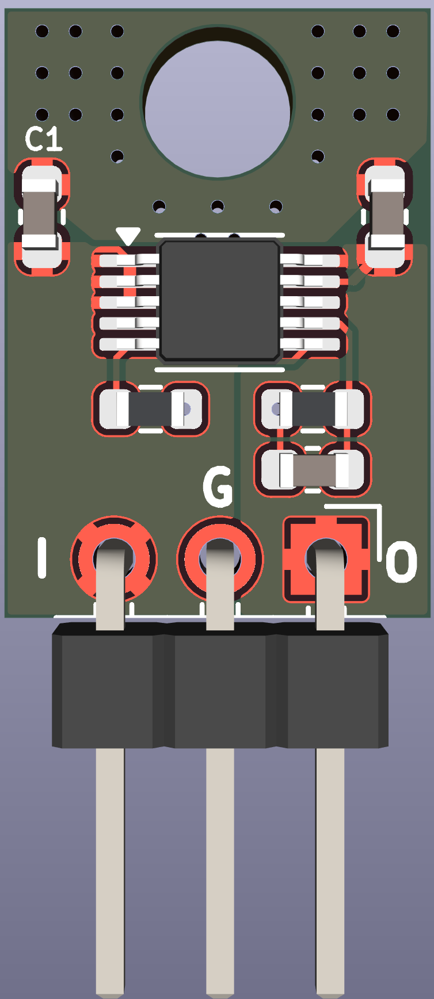

# RSPlayer Hardware

This repository contains the hardware design files for the RSPlayer project, a high-quality audio player. The designs are created in KiCad.

## Design Philosophy

This hardware design prioritizes **modularity** and **DIY-friendliness**. The goal is to provide a flexible platform where enthusiasts can easily swap components, upgrade specific subsystems (like power regulators or output stages), and experiment with different configurations. This open architecture encourages users to tweak the design, test new ideas, and continuously improve the audio performance to match their personal preferences.

## Boards
This repository is structured into several directories, each containing a specific board or a set of related files:

- **control_board_with_amanero**: A control board featuring an Amanero Combo768 USB interface.
- **lpf_ak4497**: Low-pass filter boards designed for the AK4497 DAC datasheet schematics. It includes designs for both `dual` and `dual_mono` configurations.
- [**LT3045_breakout**](https://github.com/PatrickBaus/LT3045_breakout.git): A modular breakout board for LT3042/LT3045 ultra-low noise regulators, used as drop-in replacements for 78xx series regulators.
- [**rsplayer_hardware_docs_private**](https://github.com/ljufa/rsplayer_hardware_docs_private.git): Contains external datasheets for various components used in the project. (this is private due to copyright)
- **MyLibrary.pretty**: A custom KiCad footprint library for this project.

## Features & Benefits

### Core Control & Interface
*   **MCU:** Powered by the **Raspberry Pi Pico (RP2040)**, providing robust system management, user interface control, and configuration logic. [**Firmware is here**](https://github.com/ljufa/rsplayer_firmware.git). 
*   **USB Audio:** Dedicated socket for **Amanero Combo384/Combo768** USB interfaces, supporting high-resolution PCM and DSD playback.
*   **User Interface:** Supports a Rotary Encoder for volume/navigation, IR Receiver (TSOP312) for remote control, and headers for LCD/OLED display integration.

### High-Fidelity Audio Design
*   **Galvanic Isolation:** Full isolation between the digital control logic (Pico/USB) and the sensitive DAC/Audio circuitry. Uses high-speed isolators (e.g., IL715E, ADuM1250) to eliminate ground loops and prevent digital noise from affecting audio quality.
*   **Hardware Muting:** Relay-based output muting protection to prevent audible pops and clicks during power cycles or sample rate changes.
*   **I2S Source Switching:** Features an intelligent I2S switching circuit using dual **74AC573** Octal Latches. This setup acts as a high-speed multiplexer, allowing seamless selection between the **Amanero USB interface (Source B)** and the **Optical/TOSLINK Input (Source A)**, controlled directly by the Raspberry Pi Pico.
*   **I2S & DSD Support:** Native handling of I2S and DSD signals routed directly to the DAC interface.

### Advanced Power Management
*   **Ultra-Low Noise Regulation:** Critically sensitive DAC stages are powered by modular **LT3042/LT3045** regulators. These are implemented as separate breakout boards (based on the `LT3045_breakout` design) acting as high-performance drop-in replacements for standard regulators, providing industry-leading low noise (0.8µVrms) and ultra-high PSRR.
*   **Multi-Rail Linear PSU:** On-board rectification and regulation generating separate clean rails for digital (3.3V), analog, and op-amp stages.
*   **Smart Power Control:** Relay-controlled AC mains switching allows for standby modes and remote power-on capabilities.

## Schematics

## PCB

## Future Roadmap
The project is evolving to become a universal high-fidelity audio platform. Planned improvements include:
*   **Expanded Interface Support:** Adding compatibility for additional **USB-to-I2S** boards beyond the Amanero series.
*   **Universal DAC Support:** Developing adapters and firmware logic to support a wider variety of **DAC chips and boards** (e.g., ESS Sabre, Burr-Brown), allowing users to choose their preferred sound signature.

## Related Projects
The RSPlayer is a multi-repository project:

- [**rsplayer**](https://github.com/ljufa/rsplayer.git): The main music player software running on PC or SBC.
- [**rsplayer_firmware**](https://github.com/ljufa/rsplayer_firmware.git): Firmware for MCU on this board. 

## License
This project is licensed under the MIT License. See the [LICENSE](LICENSE) file for details.

