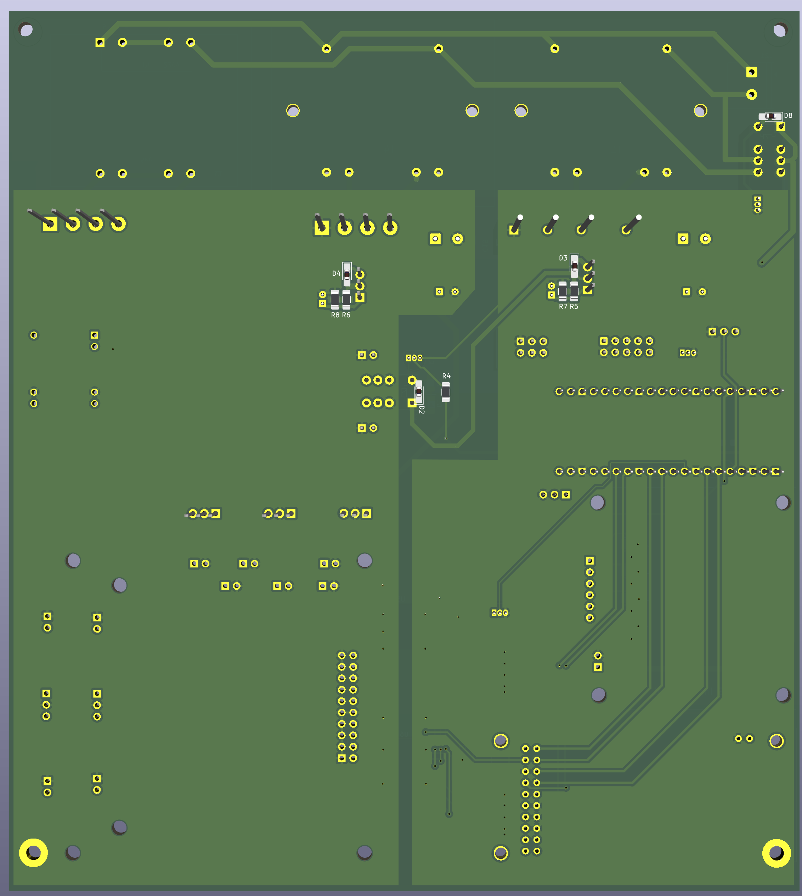

# RSPlayer Hardware - Experimental!!!

This repository contains the hardware design files for the RSPlayer project, a high-quality audio player. The designs are created in KiCad.

## Boards

This repository is structured into several directories, each containing a specific board or a set of related files:

- **control_board_with_amanero/**: A control board featuring an Amanero Combo768 USB interface.
- **control_board_with_gpio_header_pcb_done/**: An alternative control board that uses a GPIO header instead of the Amanero interface.
- **lpf_ak4497/**: Low-pass filter boards designed for the AK4497 DAC. It includes designs for both `dual` and `dual_mono` configurations.
- **psu_analog/**: The analog power supply unit for the project.
- **psu_digital/**: The digital power supply unit for the project.
- **docs and datasheets/**: Contains datasheets for various components used in the project.
- **MyLibrary.pretty/**: A custom KiCad footprint library for this project.

## Related Projects

The RSPlayer is a multi-repository project:

- **rsplayer**: The main application software. (Located at [/rsplayer](../rsplayer))
- **rsplayer_firmware**: Firmware for the hardware components. (Located at [/rsplayer_firmware](../rsplayer_firmware))

## License

This project is licensed under the MIT License. See the [LICENSE](LICENSE) file for details.

## PCB

